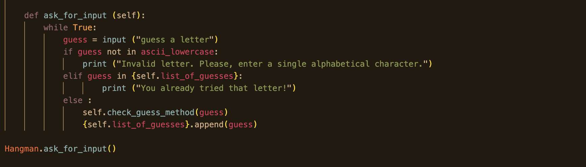

# ** Hangman project
-----------------------------------------------------------------------------------
first project learning code, with the use of the following technologies: VS Code, Python, Git, Github and other minipackages such as PYtest.

## Milestone 1.0
-----------------------------------------------------------------------------------
- Using python built in functions I have created a list containing 5 of my favourites fruits. By coding certain characters I am able to use different like the list[] function or the print() function as demonstrated below.

## Milestone 1.1
---
- In this milestone I used a theh Python built-in *import random* module which allows the user to return a rnadom item from a given sequence through the *choice* method. By using *random.choice* method and passig the *word_list* from milestone 1 as the *choice* variable it allows us to randomly generate a word from *word_list*. I assigned the generated word to the variable *word*

## Milestone 1.2
---
- In this milestone I used the *input* function to get the user to input a single letter in the from a string which I assigned the variable *guess*. To validate the input I used *if* statements to make a conditional that the input should be a single alphabetical letter. If the condition is met, I used the *print* function to  print "Good Guess!". if the conditional is not met I used the *else* block to print "Oops! That is not a valid input."

## Milestone 2.0
-----------------
- In this task I created a code that will continuously ask the user for a letter and validate it.
- By creating a while loop with the condition set to true allowed the code to run continuously. In the body of the while loop I  wrote the code for the following steps instructions:
    - Asking the user to guess a letter and assigning it to the guess variable.
    - Checking the guess is a single, alphabetical character.
    - Break out of the loop if the guess passes the checks.
    - By utilisng the use of else statement if the guess does not pass the checks, print a message saying "Invalid letter. Please, enter a single alphabetical character."

## Milestone 2.1

- In this task I had to check whether the letter guessed by the user is in the secret randomly chosen word generated by the computer. e.g. if the user guesses the letter "r" and the secret word is "serene", then the code checks if "r" is in "serene".
- To accomplish this I created an if statement to check if the guess is in the word. In the body of the if statement, I created code to print a message saying "Good guess! {guess} is in the word.". For {guess} I used the .format function to show the actual guess type by the user. I then created an else block that prints a message saying "Sorry, {guess} is not in the word. Try again." if the guess is not in the word.

## Milestone 2.2

### In this part of the task I had to create 2 functions: check_guess and ask_for_input functions. 
- The check_guess function will take the guessed letter as an argument and check if the letter is in the word.
    - I defined a function called check_guess. Then passed in the guess as a parameter for the function.
    - In the body of this function I wrote a code to convert the guess into lower case.
    - I then moved the code I wrote to check if the guesss is in the word into this function block.

- The ask_for_input function will ask the user for inpout.
    - I defined a function called ask_for_input.
    - I then moved the code to Iteratively check if the input is a valid guess task 
    - I called the check_guess function to check if the guess is in the word into this function block, but outside the while loop and passed in the guess as an argument to the method.
    - I then called the ask_for_input function to test your code outside the function.

## Milestone 3.1 - Creating class
---
- For this I had to create a Hangman *class*. As the pictures below displays. *CLass* allows the means of bundling data and functionality. This created a new object which allowed for *instances* of that object to made. Each instance of the object has an *attribute* attached to it to maintain its state. However class instances can have methods (Defined by its class) which allow its state to be modified (refer to Milestone 3.2). Through watching the prerequisite content and more research and actually applying trial attempts to code myself did I start understanding the basics of what a class does.

## Milestone 3.2 - Methods for running checks 
---
*method is a function that is defined inside a class.*

- I created 2 methods:
    1. a method that will ask the user to guess a letter and that will check if the guess is in the word:
        - to create this method I used the *def* function to create the *check_guess_method* and passed the word guess as the parameter.
        - In the body of the method, I created for: 
            -converting the guessed to lower caser using the *.lower* function which returned the letter in minuscule case.
            - I created an if statement that checks if the guess is in the word. If this was true in the body of the statement I wrote code to print "Good guess! {guess} is in the word." By using the *{}* and passing guess though  it allows me to format the string and print the letter guessed by the user.

    2.  a method that will check if the guess is in the word:
        - Again I used the *def* function to create the *ask_for_input* and wrote th following code in the body:
            - a while loop with the condition set to true.(refer to ask_for_input.png)
            - I asked the user to guess  a letter and assigned it the varible guess through the *input()* which will display the message guess a letter but return the letter guessed by the user.
            - I created an *if* statement that runs if the guess is NOT a single alphabetical character by implimentign the buit in *ascii_lowercase* to ensure the guesss is a letter and not a number or other charater:
                - In the body of the if statement, I wrote code printing "Invalid letter. Please, enter a single alphabetical character."
            - I created an *elif* statement that checks if the guess is already in the list_of_guesses. THis was done using in function whcih allowed me to pass guess through the list_of_guesses  and check if the letter has already been used by the user:
                - In the body of the elif statement, I wrote code printing "You already tried that letter!".
            -However if the guess is a single alphabetical character and it's not in the list_of_guesses:, I created an else block and called the check_guess method and passed the guess as an argument.
            - I wrote code to add the guess to the list_of_guesses which I achieved by imploying *.append()* which appended the guess to list_of_guesses.
            - I then called the ask_for_input method to test your code. To do this I *game* to instantiate the class and passed thtough wordlist as a parameter. I followed this up by calling game.ask_for_input().

## Milestone 3.3 - What happens if the letter is in word
---
- In this task I extend the check_guess_method to replace the underscore(s) in the word_guessed with the letter guesssed by the user.In the if block of your check_guess method, after your print statement:
    -I created a *for-loop* that will loop through each letter in the word using the *indexing* function which allows me to refer to an element of an iterable by its position within the iterable and the *enumarate()* function which adds a counter to an iterable and returns it in a form of enumerating object. 
        - Within the for-loop, i proceeded:
            -to create an *if* statement that checks if the letter is equal to the guess through the use of *==* operator that compares the value or equality of two objects.
                - In the if block, I replaced the corresponding "_" in the word_guessed with the guess, by *indexing* the word_guessed at the position of the letter and assign it to the letter. This was acheived buy assiging the *word_guessed [indx]* to the letter.
        - Outside the for-loop, I reduce the variable num_letters by 1.

## Milestone 3.4 What happens if the letter is NOT in word
---
- In this task I had to define what happens if the guess is not in the word you are trying to guess:
    -Step 1. In the check_guess method, I created an *else* statement. Within the else block:
        - I reduced the `num_lives' by 1.
        - Then I wrote code to print "Sorry, {letter} is not in the word."
        - and again wrote code to print another message saying "You have {num_lives} lives left." By using the *{}* in this code allows me to format string and print the value of num_lives.
    - Outside the else, I appended the guess to the list_of_guesses using the *.append()* to ensure that the letter can be appended to the list_of_guesses in both conditions.

## Conclusion 
---
- From my understanding of the project so far is that most of the tools needed to write code are there it is matter of learning and trying different approaches to problems. As the project progresses I'm understanding how the small pieces of code (statements and while loops) are used to create other bigger codes (functions).
- From building the Hangman class I can see why the object oriented programming is vital to coding as it makes handling large code easier by providing the user simpler, consistent structures. 

